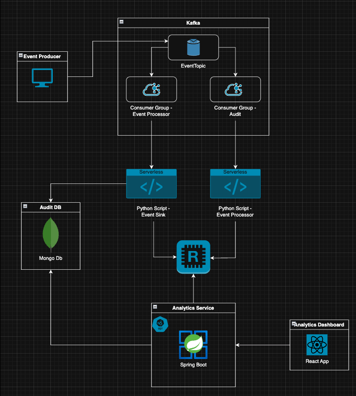
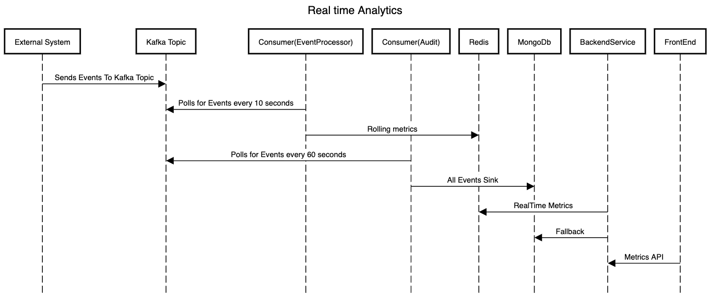

# Real-Time Event Processing with Analytics Dashboard

This project is a **local simulation** of a real-time analytics pipeline that:

- Ingests JSON events via Kafka
- Validates and processes them for rolling metrics (active users, page views, active sessions)
- Updates **Redis** for low-latency dashboard queries
- Stores **all events** (valid & invalid) in MongoDB for auditing
- APIs for fetching the metrics
- React based Frontend app to view the metrics

## 🛠️ Architecture Overview



- **Producer**: Sends simulated JSON events to Kafka
- **Kafka**: Acts as a durable, decoupled event broker
- **Consumer A (Event Processor)**:
  - Reads events from Kafka
  - Validates events - Invalid events are logged and dropped.
  - Updates Redis with rolling metrics (TTL-based keys)
  - Runs every ~10 seconds for near real-time dashboard updates
  - More details are given below (Metrics & Calculation Logic)
- **Consumer B (Audit Sink)**:
  - Reads events from Kafka
  - Validates events
  - Bulk inserts all events (valid & invalid) into MongoDB every ~60 seconds
  - Includes validation status and error reason for failed events
- **Backend (SpringBoot)**:
  - Provides API endpoint to retrieve near real time user metrics
  - Aggregates from Redis Cache
- **Frontend (React)**:
  - A simple Frontend app which connects to backend APIs to dispaly the metrics
  - Refreshes every 30 seconds
  - Uses React + schadcn components



---

## 🏗 Architecture Choices

This design was selected to meet the following key requirements:

- Handle ~100 events/second reliably
- Keep UI metrics updated every 30 seconds with minimal latency
- Retain audit history of all events for compliance/debugging
- Support local development and future scalability

---

- **Kafka as the Ingestion Layer**

  - Why: Decouples producers from consumers, providing buffering, durability, and replay.
  - Allows multiple independent consumers (e.g., metrics updater & audit logger) to process the same events in parallel via different consumer groups.
  - Handles burst traffic without overwhelming downstream systems.

- **Redis for Real-Time Metrics**

  - Why: In-memory store with TTL support for fast rolling-window calculations.
  - Metrics like "Active Users (5 min)" and "Page Views (15 min)" can be maintained in O(1) update time per event.
  - TTL-based keys ensure automatic expiry of old data without manual cleanup.
  - Chosen over SQL/NoSQL for the metrics layer due to sub-millisecond read performance.

- **MongoDB for Audit Storage**

  - Why: Document-oriented storage is ideal for storing raw event payloads with flexible schema.
  - Supports easy querying for troubleshooting, analytics, or compliance.
  - Bulk insertion reduces write amplification and ensures better throughput for audit storage.

- **Two Consumer Groups**

  - Metrics Consumer (event-processor):
    - Reads from Kafka, validates, and updates Redis every few seconds.
    - Optimized for low-latency updates to the dashboard.
  - Audit Consumer (audit):
    - Reads the same Kafka events, validates, and bulk inserts into MongoDB every ~60 seconds.
    - Optimized for write efficiency over low latency.

- **Event Validation in the Consumer Layer**

  - Keeps producers lightweight and ensures all downstream consumers receive consistent, validated data.
  - Invalid events are also persisted (marked with status & error reason) to avoid silent data loss.

- **Rolling Window via Key Partitioning**

  - Per-minute bucketed keys ({metric}:{minute_bucket}) with TTL to handle rolling time windows.
  - Keeps Redis memory usage predictable and allows for quick aggregation at query time.

- **Local Development-Friendly**
  - All components run in Docker Compose.
  - No external dependencies required for simulation.

---

## ❓ Why Not… (Trade-Offs)

**Why not SQL for metrics?**

- SQL could store metrics but would require constant INSERT/DELETE or UPDATE for rolling windows, adding write load.
- Redis TTL-based expiry is simpler and faster for high-throughput, real-time metrics.

**Why not store both metrics and audit data in Mongo only?**

- Mongo is slower for high-frequency aggregation compared to Redis.
- Would require aggregation pipelines on every dashboard query, adding latency.

**Why not a single consumer for both Redis & Mongo?**

- Mixing low-latency writes (Redis) with bulk writes (Mongo) in one consumer introduces unnecessary coupling.
- Separate consumers allow independent scaling, retries, and optimizations.

**Why not batch events in Kafka before consuming?**

- Kafka already buffers events; batching on the producer side delays real-time updates.
- Instead, batching is done in the Mongo audit consumer where low latency is not critical.

## 📦 Tech Stack

- **[Apache Kafka](https://kafka.apache.org/)** — Event streaming platform
- **[Redis](https://redis.io/)** — In-memory store for rolling metrics
- **[MongoDB](https://www.mongodb.com/)** — Persistent storage for audit logs
- **[Python](https://www.python.org/)** — Consumers & producers
- **[Spring Boot](https://spring.io/projects/spring-boot/)** — Backend APIs
- **[React](https://react.dev/)** — Dashboard frontend
- **[Docker Compose](https://docs.docker.com/compose/)** — Local orchestration

---

## ⚙️ Local Setup

### 1️⃣ Clone the repository

```bash
git clone https://github.com/akhilanil/RealTimeAnalytics.git
cd RealTimeAnalytics
```

### 2️⃣ Start All services

```bash
docker-compose up -d
```

This spins up

- kafka
- Redis
- MongoDB
- Two containers depcting serverless scripts
- Backend Spring boot api
- Frontend react web application
- Event producer

###  Event producer (simulated events)
- This script produces events to Kafka in batches with controlled pacing and an adjustable pause between batches.
- Initialize Producer
  - Ensures the Kafka topic exists.
  - Creates a single producer instance that is reused for all batches.
- Batch Execution
  - Each batch sends a random number of events per second between 20 and 100.
  - The interval between events is calculated as: `interval = 1.0 / total_events_per_second`
- Event Sending
  - Sends total_events_per_second events for the current batch.
  - Sleeps for interval seconds between each event to maintain rate.
- Batch Pause
  - After all events in the batch are sent, the producer flushes its buffer.
  - The script then waits for K seconds before starting the next batch.
  - K is configurable via an environment variable `WAIT_SECONDS_AFTER_BATCH`. You can configure in `docker-compose.yaml`


### View Dashboard

Open http://localhost:5173/dashboard in browser for viewing dashboard

---

## 📊 Metrics & Calculation Logic

- **Active Users** (last 5 minutes)

  - **Definition**: Unique user_ids that have generated events in the past 300 seconds.
  - **Redis Structure**:
    - Key: active_users:{minute_bucket}
    - Type: SET
    - Value: user_id
    - TTL: 300 seconds
  - **Update**:
    - On each valid event, do SADD active_users:{minute_bucket} user_id
    - Set key expiry to 300 seconds
  - **Read**:
    - Union the sets for the last 5 minute buckets → count unique elements.

- **Page Views by URL** (last 15 minutes)
  - **Definition**: Number of page_view events per page_url in the last 900 seconds.
  - **Redis Structure:**
    - Key: page_views:{minute_bucket}
    - Type: ZSET
    - Member: page_url
    - Score: running count (float; treated as integer)
    - TTL: 900 seconds
  - **Update:**
    - On each page_view event:
      - ZINCRBY page_views:{minute_bucket} 1 <page_url>
      - EXPIRE page_views:{minute_bucket} 900
  - **Read:**
    - Build keys for the last 15 minute buckets (UTC).
    - Server-side union with SUM into a short-lived temp ZSET:
      - `ZUNIONSTORE tmp:page_views:rolling:<ts>:<uuid> N <k1> <k2> ... <kN> AGGREGATE SUM`
      - `EXPIRE tmp:page_views:rolling:<ts>:<uuid> 10`
    - Fetch Top-K
      - `ZREVRANGE tmp:page_views:rolling:<ts>:<uuid> 0 <K-1> WITHSCORES` (done in Spring)

- **Active Sessions per User** (last 5 minutes)
  - **Definition:** Unique session_ids for each user_id in the last 300 seconds.
  - **Redis Structure:**
    - Key: active_sessions:{user_id}:{minute_bucket}
    - Type: SET
    - Value: session_id
    - TTL: 300 seconds
  - **Update:**
    - On each event, SADD active_sessions:{user_id}:{minute_bucket} session_id
    - Set expiry to 300 seconds
  - **Read:**
    - For a given user_id, union last 5 minute buckets to get session count.

---

## 🗄 MongoDB Audit Collection

- Collection: `events`
- Example Document:

```json
{
    "_id": "68979be4651aaf51086dd15f",
    "doc_type": "success",
    "timestamp": "2025-08-09T19:04:31.239503+00:00",
    "user_id": "usr_6",
    "event_type": "page_view",
    "page_url": "/products/electronics",
    "session_id": "sess_71"
}
{
    "_id": "6897b74f651aaf51086dd173",
    "doc_type": "failed",
    "timestamp": "2025-08-09T21:02:07Z",
    "failed_event": "{\"timestamp\": \"2025-08-09T21:01:36.474580+00:00\", \"user_id\": \"usr_2\", \"page_url\": \"/products/add\", \"session_id\": \"sess_54\"}",
    "reason": "Missing fields: [\\'event_type\\']"
}
```

---

## 📡 API Design

The system exposes a minimal REST API for the dashboard to retrieve real-time metrics from Redis.
All endpoints are under the base path: `/api/v1/dashboard`

- **Get Active Users**
  - Endpoint: `GET /api/v1/dashboard/active-users`
  - Description: Returns the list of active users in the last 5 minutes.
  - Query Params: None
  - Error Handling:
    - On internal error: returns 500 Internal Server Error with an empty list.
  - Response (200 OK):

```json
{
  "userDetails": [
    {
      "userId": "usr_123",
      "sessionCount": 3
    },
    {
      "userId": "usr_456",
      "sessionCount": 1
    }
  ]
}
```

- **Get Top Viewed Pages**
  - Endpoint: GET /api/v1/dashboard/page-views
  - Description: Returns the most viewed pages in the last 15 minutes.
  - Query Params:
    - `offset` (optional, int) → Number of results to return (default: 5)
  - Error Handling:
    - On internal error: returns 500 Internal Server Error with an empty list.
  - Response (200 OK):

```json
{
  "pageViews": [
    {
      "pageUrl": "/products/electronics",
      "viewCount": 120
    },
    {
      "pageUrl": "/products/books",
      "viewCount": 95
    }
  ]
}
```

Notes:

- Responses are built from Redis-stored rolling metrics, so results are up-to-date within a few seconds of event ingestion.
- All timestamps used in metric calculations are in UTC to avoid timezone-related inconsistencies.
- Security considerations are documented separately for production environments.

---

## 🚦 Error Handling

- #### Validation Failures:
  - Marked as invalid with error_reason
  - Still stored in MongoDB for auditing
- #### Redis Down:
  - Metrics consumer logs error and can retry; failures do not affect audit consumer
  - As a fallback data can be retrieved from Mongo (Not implemented)
- #### Mongo Down:
  - Audit consumer buffers temporarily; retries with exponential backoff

---

## 🔒 Security Considerations

(Documented, not implemented for local run)

- API endpoints to fetch dashboard data should require authentication
  - SSO for dahsboard users
  - JWT tokens for APIs
- Protect Redis & Mongo with authentication and network restrictions in production

## 📝 Improvements for Production

- Deploy in Kubernetes with health checks (/actuator/health)
- Use JSON Schema / Avro + Schema Registry for producer–consumer contract enforcement
- Add DLQ topic for failed events instead of only marking them in audit DB
- Implement monitoring & alerting (Splunk/Grafana/Datadog)
- Add SSO for dashboard and use JWT tokens for APIs.
- Paginated view for user session count
